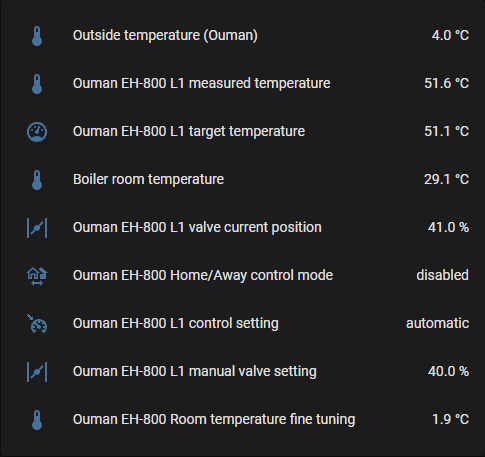

# ouman2mqtt

Ouman EH-800 stats export to MQTT (and Home Assistant) 

## TL;DR - Working with Home Assistant



To get your Ouman parameters on Home Assistant:

- Set up a MQTT broker, for example Mosquittto
- Add the MQTT integration to HA and connect it to the broker
- Run ouman2mqtt with `--ha-support` to feed in Ouman data

## Using a Docker container

### Build it

```
docker build -t vaizki/ouman2mqtt:0.0.1 .
```

Note: There is a `linux/arm/v7` architecture image for RasPi use at [Docker Hub](https://hub.docker.com/repository/docker/vaizki/ouman2mqtt)

### Run it

Example: Running in host network space (same localhost) with HA support enabled:
```
docker run --net host -e OUMAN_OUMAN_URL=http://my-ouman.example.com/ -e OUMAN_MQTT_BROKER=127.0.0.1 -e OUMAN_HA_SUPPORT=yes vaizki/ouman2mqtt:0.0.1
```

## Running in virtual environment

```
python3.9 -m venv venv
source venv/bin/activate
pip install -r requirements.txt 
python -m ouman2mqtt --ouman-url http://my-ouman.example.com/
```

## Usage & Configuration

Configuration can be via environment variables, command line or an ini-style config file.

The only required parameter is the URL of the Ouman controller (`--ouman-url`). MQTT Broker is by default on 127.0.0.1

```
usage: ouman2mqtt.py [-h] [-c CONFIG] [-d] [--mqtt-broker MQTT_BROKER] [--mqtt-topic MQTT_TOPIC] [--mqtt-publish-values] [--mqtt-publish-interval MQTT_PUBLISH_INTERVAL] [--mqtt-retain-state] [--ha-support]
                     [--ha-instance HA_INSTANCE] [--ha-expire-after HA_EXPIRE_AFTER] [--ha-assume-online] [--ha-status-topic HA_STATUS_TOPIC] --ouman-url OUMAN_URL [--ouman-name OUMAN_NAME]

optional arguments:
  -h, --help            show this help message and exit
  -c CONFIG, --config CONFIG
                        config file location
  -d, --debug           Debug mode / messages [env var: OUMAN_DEBUG]
  --mqtt-broker MQTT_BROKER
                        [env var: OUMAN_MQTT_BROKER]
  --mqtt-topic MQTT_TOPIC
                        [env var: OUMAN_MQTT_TOPIC]
  --mqtt-publish-values
                        Publish raw values to per-item topics under #/values/+ [env var: OUMAN_MQTT_PUBLISH_VALUES]
  --mqtt-publish-interval MQTT_PUBLISH_INTERVAL, -i MQTT_PUBLISH_INTERVAL
                        [env var: OUMAN_MQTT_PUBLISH_INTERVAL]
  --mqtt-retain-state   Publish #/state objects with retain [env var: OUMAN_MQTT_RETAIN_STATE]
  --ha-support          Home Assistant MQTT discovery support [env var: OUMAN_HA_SUPPORT]
  --ha-instance HA_INSTANCE
                        Prefix for HA entity object ids [env var: OUMAN_HA_INSTANCE]
  --ha-expire-after HA_EXPIRE_AFTER
                        How many seconds without updates before HA considers state unavailable [env var: OUMAN_HA_EXPIRE_AFTER]
  --ha-assume-online    Publish state/values even if HA state is unknown or offline [env var: OUMAN_HA_ASSUME_ONLINE]
  --ha-status-topic HA_STATUS_TOPIC
                        Topic where HA publishes offline/online status [env var: OUMAN_HA_STATUS_TOPIC]
  --ouman-url OUMAN_URL
                        HTTP URL for Ouman web interface [env var: OUMAN_OUMAN_URL]
  --ouman-name OUMAN_NAME
                        [env var: OUMAN_OUMAN_NAME]

Args that start with '--' (eg. -d) can also be set in a config file (specified via -c). Config file syntax allows: key=value, flag=true, stuff=[a,b,c] (for details, see syntax at https://goo.gl/R74nmi). If an arg is
specified in more than one place, then commandline values override environment variables which override config file values which override defaults.
```

## Home Assistant support

If `--ha-support` is enabled, then:

- We wait for HA to become online by watching the HA status topic (default `/homeassistant/status`)
  - Alternatively use `--ha-assume-online` to always publish config and state messages
- MQTT Discovery messages are sent to HA over MQTT which will configure entities automatically
- Ouman is polled periodically (every `--mqtt-publish-interval`, defauult 15s)
  - Based on if we can get data from Ouman, we publish a message `online` or `offline` to a status topic (default `ouman2mqtt/ouman/status`) so that HA knows to set entities as unavailable if there is no data
  - A single state message (default topic `ouman2mqtt/ouman/state`) with a JSON object containing all parameters is sent

Notes on HA interworking:
- The default for `--ha-expire-after` is (3 * `--mqtt-publish-interval` + 1s) after which HA will treat data as stale. Set it to 0 to disable expiry.
- For smooth operation at startup, you should configure the HA MQTT integration to retain birth and will messages. This way ouman2mqtt will get the status of HA immediately when it starts up.
- If you have multiple Ouman controllers, run multiple copies of ouman2mqtt and use `--ha-instance` to name them (default is `ouman`)


## Limitations

- Only one control loop (L1) is supported because I only have one
- There is no write-support (and most likely never will be)


## Future

- Split this repo into three, EH-800 lib, asycio2mqtt (generic base repo) and ouman2mqtt
- Add HTTP basic auth if anyone asks for it 
- Open an issue and we'll see


## Security Notice

EH-800 has **ZERO** security on the HTTP interface! This is why we don't even need the username and password to read/write parameters.

**Never** expose your Ouman directly to the Internet, even on a non-standard port.


